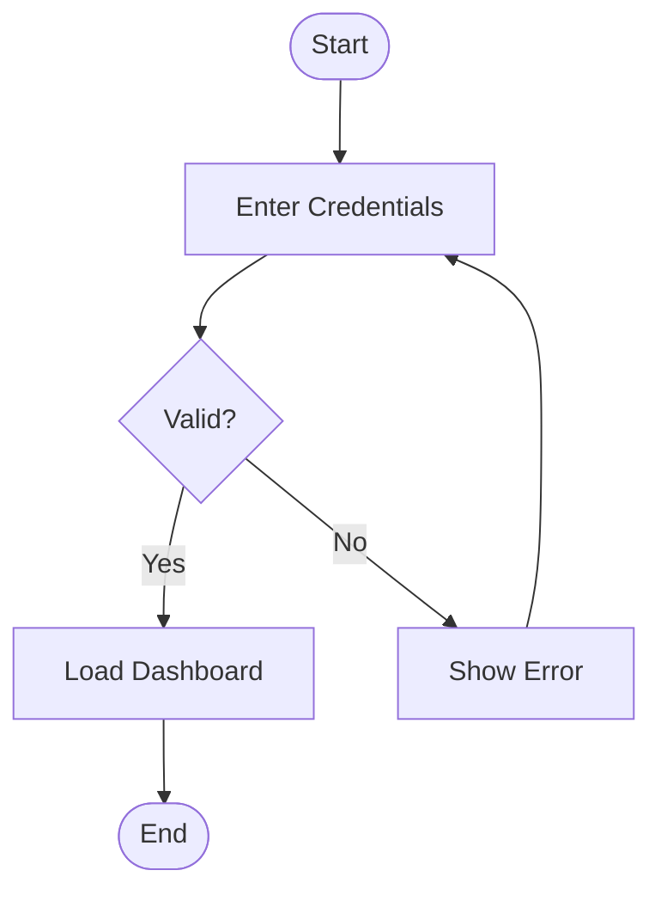
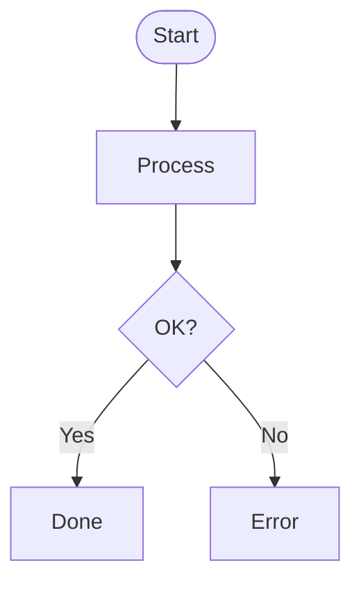

# MermaidFlow Animator — Obsidian Plugin

> 🌐 **Languages:** **English** · [Português](README.pt-BR.md)

Render Mermaid flowcharts as **live animated diagrams** inside Obsidian. Green (success) and red (error) particles flow through pipe-styled edges, helping you explain processes, requests, state machines, and any pipeline that has decisions.

> Companion to the web app: [mermaid-flow-animator.pages.dev](https://mermaid-flow-animator.pages.dev/)

---

## Usage

In any note, use a fenced code block with language `mermaid-flow`:

````markdown

````

The block becomes an interactive diagram:

- Automatic layout via dagre
- Pipe-style edges (4 layers with glow)
- Auto-spawn of particles every ~2s at start nodes
- Alternating type per spawn (success, error, success…)
- After the first decision node, particles randomly pick 50/50 — over time they explore both branches
- Loops detected via per-node revisit count (limit: 3 visits)
- **Click any node** to dispatch a manual particle from there

### Configuration via `%%` comments

Customize animation behavior by adding **`%%` comments at the top of the block**. They are idiomatic Mermaid (won't break the parse) and accept either `key: value` or `key=value` pairs:

````markdown

````

| Key | Accepted values | Default | What it does |
|---|---|---|---|
| `type` | `success` &#124; `error` &#124; `alternate` | `alternate` | Which kind of particle to spawn at start nodes. `success` (green) only success, `error` (red) only error, `alternate` interleaves them. |
| `speed` | `0.1` – `10` (with optional `x` suffix) | `1` | Speed multiplier. `1` = 1 edge per second. `2` or `2x` = twice as fast. `0.5` = slow motion. |
| `interval` | `200` – `10000` (ms) | `2200` | Time between auto-spawn batches at start nodes. Lower = more particles on screen. |
| `spawn` | `1` – `10` | `1` | How many particles each batch dispatches (every `interval` ms). |
| `controls` | `true` &#124; `false` &#124; `show` &#124; `hide` | `true` | Show/hide the play-pause button in the top-left corner. Useful for clean GIF recordings. |

Practical examples:

```mermaid-flow
%% Success-only, fast, two at a time
%% type: success
%% speed: 2x
%% interval: 800
%% spawn: 2
```

```mermaid-flow
%% "Stress test" mode — 3 particles every 500ms
%% interval: 500
%% spawn: 3
```

```mermaid-flow
%% Clean recording demo (no controls, slow speed)
%% controls: hide
%% speed: 0.5
%% interval: 4000
```

### Play / Pause button

A `⏸` (pause) / `▸` (play) button appears in the **top-left corner** of every diagram. Clicking it pauses **the entire** animation — particles freeze in place, new spawns are suspended. Clicking again resumes seamlessly (the `dt` is reset to avoid sudden jumps).

Useful for:
- Inspecting state at a specific point in the flow
- Capturing screenshots
- Pausing while you explain to someone

To hide the button (e.g. while recording a GIF of the note), use `%% controls: hide` in the block.

### Supported Mermaid syntax

| Element | Syntax |
|---|---|
| Direction | `flowchart TD` (TB / BT / LR / RL) |
| Rectangle | `A[Label]` |
| Stadium | `A([Label])` |
| Diamond (decision) | `A{Label}` |
| Circle | `A((Label))` |
| Subroutine | `A[[Label]]` |
| Edge | `A --> B` |
| Edge with label | `A -->|Yes| B` |
| Chained edge | `A --> B --> C` |
| Comment | `%% text` (own line) |

**Not supported (yet):** subgraphs, classes/styles, click-handlers, non-flowchart Mermaid graphs (sequence, gantt, pie, etc.).

---

## Installation

### Via Community Plugins (after approval)

1. Settings → Community plugins → Browse
2. Search for **MermaidFlow Animator**
3. Install → Enable

### Manual install (BRAT or direct copy)

To try it before official approval:

1. From any release in this repository, download the 3 files:
   - `main.js`
   - `manifest.json`
   - `styles.css`
2. Place them in `<vault>/.obsidian/plugins/mermaid-flow-animator/`
3. Reopen Obsidian and enable the plugin in Settings → Community plugins

Alternative: install the [BRAT plugin](https://github.com/TfTHacker/obsidian42-brat) and add this repository as a beta plugin — BRAT keeps it auto-updated.

---

## Development

```bash
# Install dependencies
npm install

# Build watch (rebuilds on every change)
npm run dev

# Production build (minified)
npm run build

# Type check
npm run typecheck
```

### Iterating inside Obsidian

```bash
# Symlink the plugin folder into your vault
ln -s "$(pwd)" "<vault>/.obsidian/plugins/mermaid-flow-animator"

# Watch mode + auto-rebuild
npm run dev

# In Obsidian: Cmd+R to reload after changes (or use the "Hot Reload" plugin)
```

### Bumping the version

```bash
# Updates package.json + manifest.json + versions.json + creates a commit
npm version patch    # 0.1.0 → 0.1.1
npm version minor    # 0.1.0 → 0.2.0
npm version major    # 0.1.0 → 1.0.0

# Push the tag to trigger the automatic release
git push origin main --tags
```

The action [`.github/workflows/release.yml`](.github/workflows/release.yml) builds and publishes the artifacts (`main.js`, `manifest.json`, `styles.css`) as binary assets on the GitHub Release.

---

## Architecture

```
plugin/
├── manifest.json          ← Obsidian metadata
├── versions.json          ← version → minAppVersion map
├── package.json           ← plugin's own deps (no React/Vite)
├── tsconfig.json
├── esbuild.config.mjs     ← CommonJS bundle
├── version-bump.mjs       ← npm version hook
├── main.ts                ← Plugin entry; registers the "mermaid-flow" processor
├── renderer.ts            ← FlowAnimator (extends MarkdownRenderChild)
├── styles.css             ← styles applied to `.mermaid-flow-*`
├── shared/                ← core utilities (synced with the web app)
│   ├── types/graph.ts
│   └── utils/
│       ├── mermaidParser.ts
│       ├── applyDagreLayout.ts
│       ├── colorScheme.ts
│       ├── particleFactory.ts
│       └── pathCalculator.ts
├── .github/workflows/
│   └── release.yml        ← auto release on tag push
├── LICENSE                ← MIT
└── README.md              ← this file
```

`FlowAnimator` extends `MarkdownRenderChild` (Obsidian lifecycle):

1. **`onload()`** — regex-parses the source line by line → applies `applyDagreLayout` (pure dagre) → mounts the static `<svg>` with defs (arrow markers + glow filter), edges (4-layer pipe), nodes (5 shapes) and a particles layer → starts the rAF loop and the auto-spawn timer.
2. **`advanceParticles(dt)`** — for each particle: advances progress proportional to `dt`, computes position via `path.getPointAtLength()`, manages a 6-point trail. When an edge completes, it decides the next `kind` (keep, flip on revisit, or randomize after the first decision) and spawns a new particle via `pickEdgeForKind` from the core.
3. **`renderParticles()`** — clears and re-creates the SVG circles (trail + halo + core + highlight) every frame.
4. **`onunload()`** — cancels rAF + interval, clears refs. Obsidian calls this when switching notes or disabling the plugin.

No React, no virtual DOM. ~105 KB minified (dagre accounts for ~80 KB).

---

## Submission to the Obsidian Community Plugins listing

For maintainers — official approval path:

1. **Create a dedicated GitHub repo** — this plugin lives in [VivaldiCode/mermaid-flow-animator-obsidian](https://github.com/VivaldiCode/mermaid-flow-animator-obsidian).
2. **Extract** the `plugin/` folder from the monorepo to the root of that repo via `git subtree`:
   ```bash
   # From the mermaid-Visualizer monorepo (web app)
   git subtree split --prefix plugin -b plugin-only
   git push https://github.com/VivaldiCode/mermaid-flow-animator-obsidian.git plugin-only:main
   ```
3. **Push the first release tag** — the GitHub Action will build and create the release with the assets:
   ```bash
   git tag 0.1.0
   git push --tags
   ```
4. **Verify** the release has `main.js`, `manifest.json`, and `styles.css` attached as binary assets.
5. **Open a PR** at [obsidianmd/obsidian-releases](https://github.com/obsidianmd/obsidian-releases) appending an entry to [`community-plugins.json`](https://github.com/obsidianmd/obsidian-releases/blob/master/community-plugins.json):
   ```json
   {
     "id": "mermaid-flow-animator",
     "name": "MermaidFlow Animator",
     "author": "VivaldiCode",
     "description": "Render Mermaid flowcharts as live, animated diagrams — particles flow through pipe-styled edges to visualize success/error paths.",
     "repo": "VivaldiCode/mermaid-flow-animator-obsidian"
   }
   ```
6. **Wait for review** by the official maintainers (typically 1–4 weeks). They will check:
   - The plugin follows the [developer policies](https://docs.obsidian.md/Developer+policies)
   - It does not use private APIs
   - It has a valid `manifest.json` with a unique `id`
   - It works as described
7. **After the merge**, the plugin shows up automatically in the Community plugins tab inside Obsidian for any user.

Official documentation: [Submit your plugin](https://docs.obsidian.md/Plugins/Releasing/Submit+your+plugin).

---

## Syncing with the web app

The files under `shared/` are **copies** of the corresponding files in `../src/` of the web app. When you update the parser, layout, or color scheme in the web app, copy them over:

```bash
cp ../src/types/graph.ts shared/types/graph.ts
cp ../src/utils/{mermaidParser,applyDagreLayout,colorScheme,particleFactory,pathCalculator}.ts shared/utils/
```

The duplication is intentional — when the plugin is extracted to its own repository, it still works without depending on the web app's source tree.

---

## License

MIT — see [LICENSE](LICENSE).
